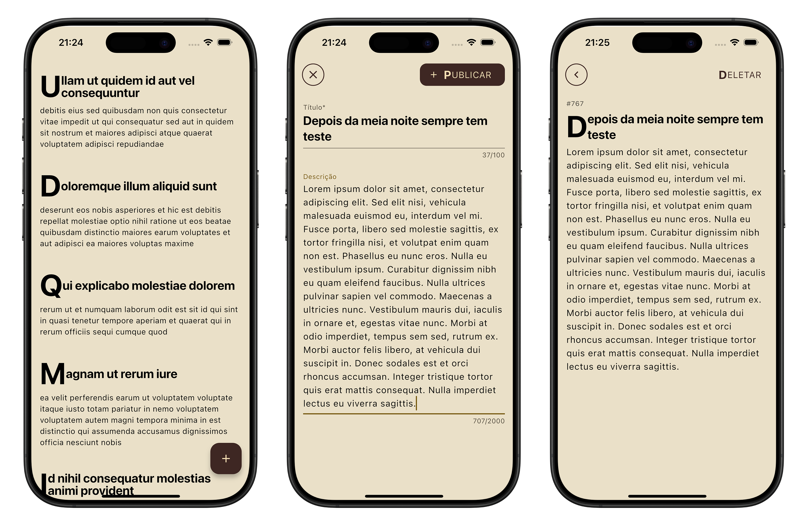
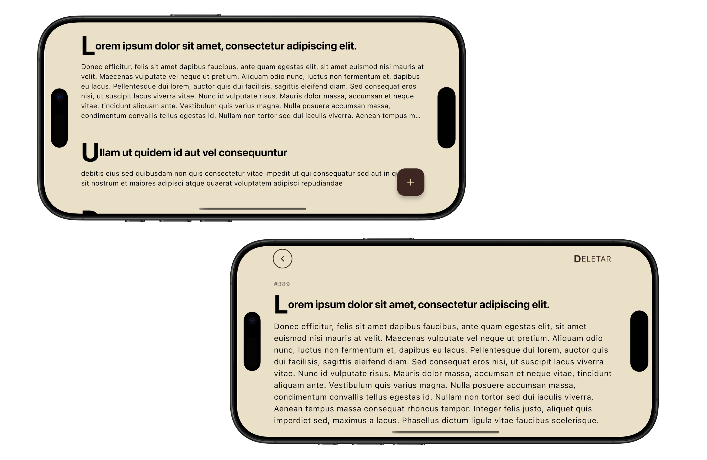

# 🌚 Flutter Posts Feed

Este aplicativo exibe uma lista de posts em um estilo minimalista, focado na leitura, sem imagens. Ele permite visualizar, criar e excluir posts, **funcionando completamente offline**. Desenvolvido em **Flutter**, utiliza **MVVM** como padrão arquitetural e **Bloc** para gerenciamento de estado.

## 📸 Capturas de Tela

### Telas




### Navegação

<p align="center">
  
</p>

## 🚀 Tecnologias Utilizadas

- **Linguagem:** Dart
- **Framework:** Flutter
- **Arquitetura:** MVVM
- **Gerenciamento de estado:** flutter_bloc
- **Injeção de dependências:** get_it
- **Persistência de dados:** shared_preferences
- **Modo Offline:** Suporte total para funcionamento sem conexão com a internet

## 💂️🏼 Estrutura do Projeto

```
lib/
├── app/                    # Lógica de negócios e UI
│   ├── models/             # Modelos de dados
│   ├── repositories/       # Lógica de acesso a dados
│   ├── services/           # Serviços e requisições HTTP
│   ├── viewmodel/          # Gerenciamento de estado
│   └── views/              # Telas do aplicativo
├── core/                   # Funcionalidades centrais
│   ├── constants/          # Constantes globais
│   ├── theme/              # Estilos globais
│   ├── utils/              # Funções auxiliares
└── main.dart               # Arquivo principal de execução
```

## 🛠 Dependências Externas

As seguintes bibliotecas foram utilizadas no projeto:

```yaml
dependencies:
  equatable: ^2.0.7
  http: ^1.3.0
  shared_preferences: ^2.5.2
  flutter_bloc: ^9.0.0
  get_it: ^8.0.3

dev_dependencies:
  build_runner: ^2.4.15
  mockito: ^5.4.5
  bloc_test: ^10.0.0
```

## ✅ Testes

O projeto inclui testes unitários e de widgets utilizando `flutter_test` e `mockito`.

Para rodar os testes:

```bash
flutter test
```

## 📌 Instalação e Execução

1. Clone o repositório:

   ```bash
   git clone https://github.com/origemjhanpoll/flutter_posts_test
   cd flutter_posts_test
   ```

2. Instale as dependências:

   ```bash
   flutter pub get
   ```

3. Execute o aplicativo:

   ```bash
   flutter run
   ```

## 🤝 Contribuição

Sinta-se à vontade para abrir issues ou enviar PRs com melhorias!

## 📝 Licença

Este projeto está sob a licença MIT.
